# Kripto E-vote

Ketika sudah mendownload file ini, jangan lupa setting env nya dulu seperti di bawah ini: 
DB_CONNECTION=mysql  
DB_HOST=127.0.0.1  
DB_PORT=3306  
<b>DB_DATABASE=(isi sesuai nama database yang kamu mau)</b>  
DB_USERNAME=root  
DB_PASSWORD=  
Di dalam DB_DATABASE boleh di isi terserah karena itu nantinya nama database, dan Selain DB_DATABASE gausah di apa-apain.  
kemudian ketikan perintah di terminal <b>"php artisan migrate"</b>, setelah itu ketikan <b>"php artisan db:seed"</b>. kemudian selesai dan di coba secara keseluruhan. 

Kemudian masih di dalam env tapi di bagian email harus di setting sama persis di bawah ini, supaya bisa mengirimkan email: 
MAIL_MAILER=smtp  
MAIL_HOST=smtp.gmail.com  
MAIL_PORT=587  
MAIL_USERNAME=senterkecil936@gmail.com  
MAIL_PASSWORD=pliszbibpeffkzde  
MAIL_ENCRYPTION=tls  
MAIL_FROM_ADDRESS="senterkecil936@gmail.com"  

Tampilan Form Login Utama

Tampilan Dashboard Admin
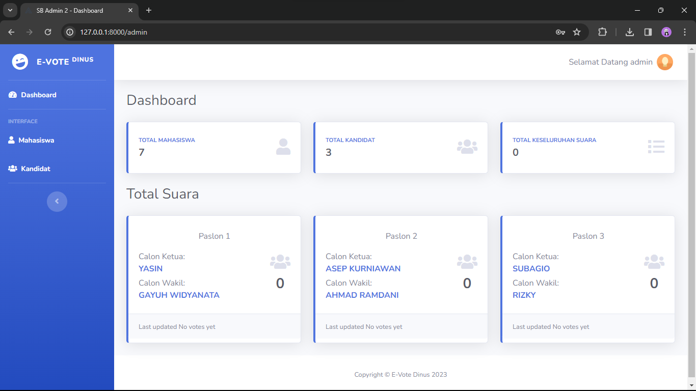

Tampilan Dashboard Admin (student)
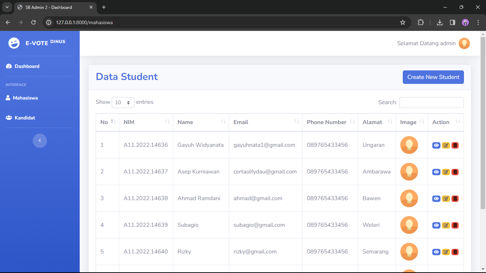

Tampilan Dashboard Admin (student)
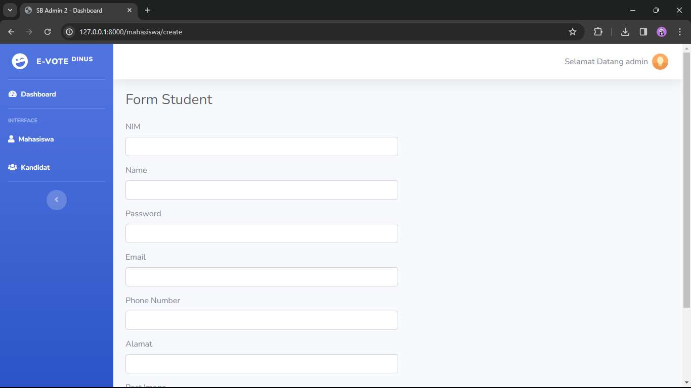

Tampilan Dashboard Admin (student)

Tampilan Dashboard Admin (student)
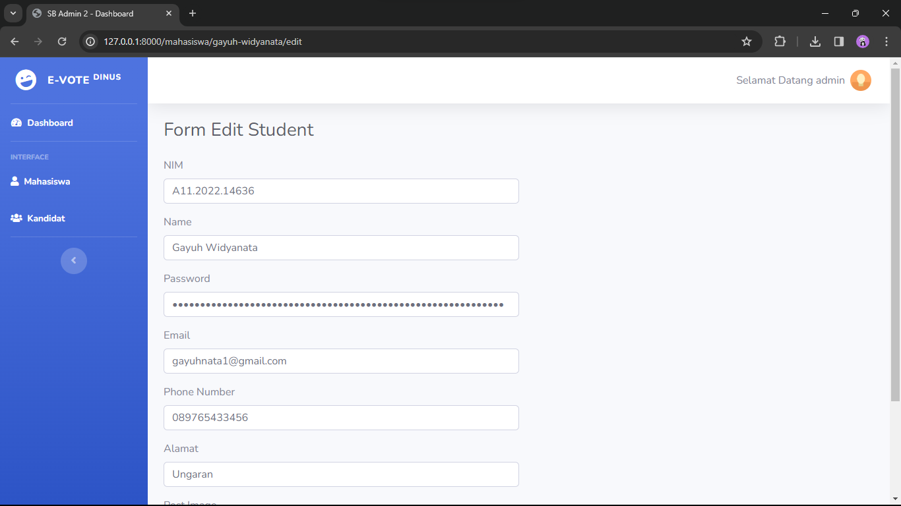

Tampilan Dashboard Admin (candidate)
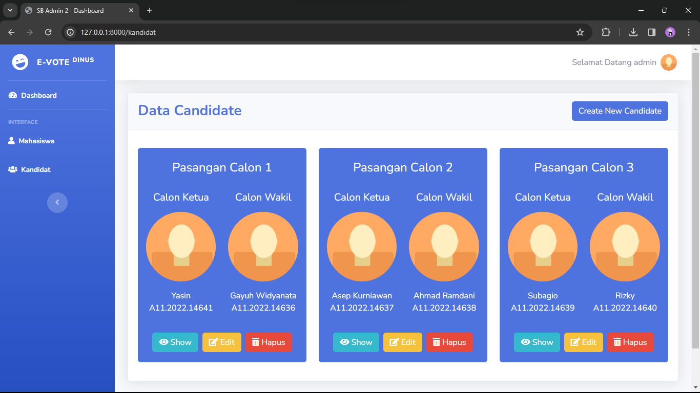

Tampilan Dashboard Admin (candidate)
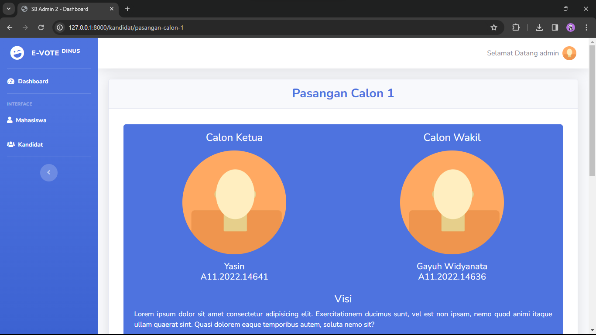

Tampilan Dashboard Admin (candidate)
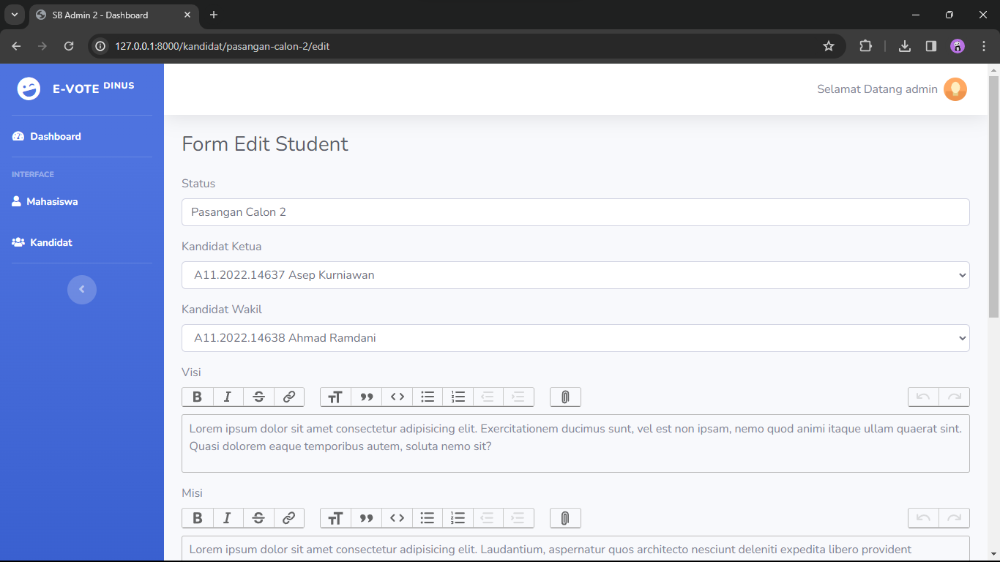

Tampilan Dashboard Student
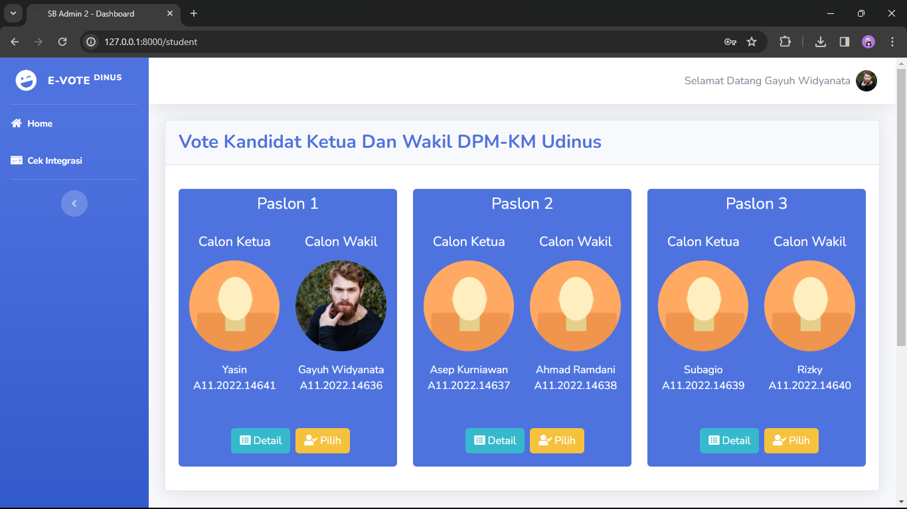

Tampilan Dashboard Student
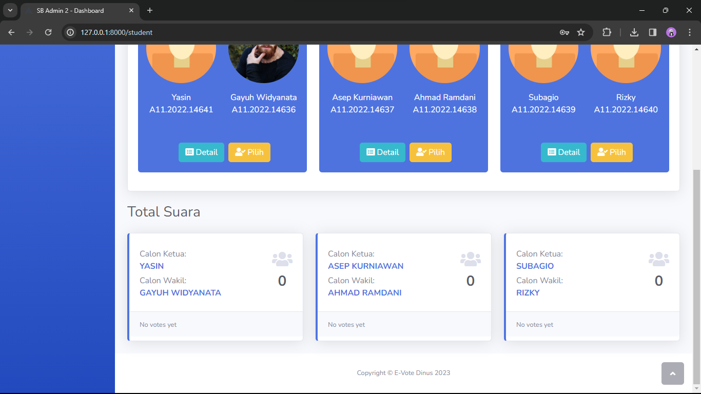

Tampilan Dashboard Student
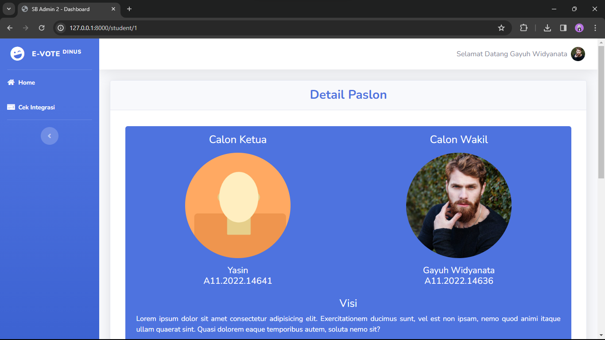

Tampilan Setelah Melakukan Vote (Tampilan Dashboard Student)
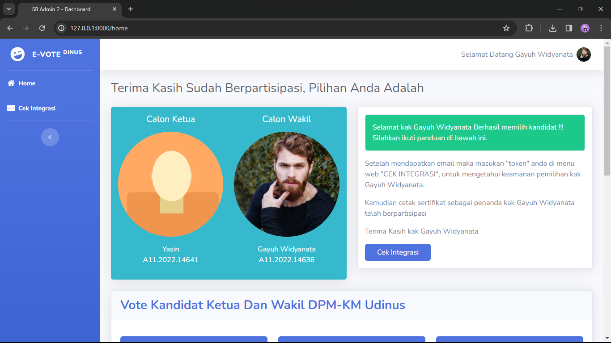

Tampilan Dashboard Student
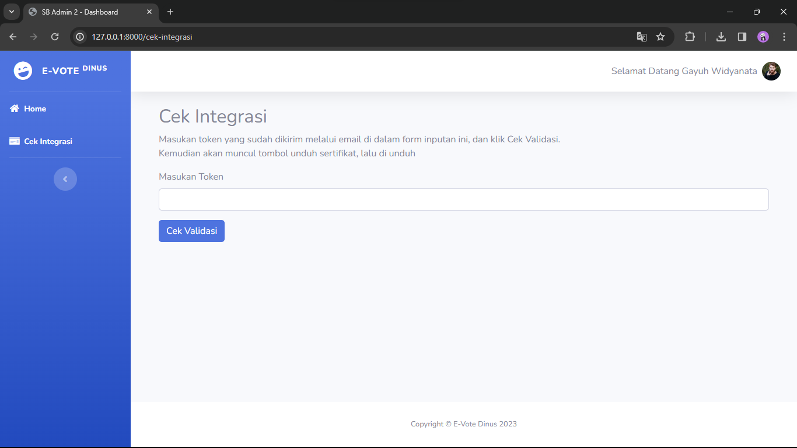

Setelah Melakukan Pengecekan Integrasi Yang Di Kirim Dari Email( Tampilan Dashboard Student)
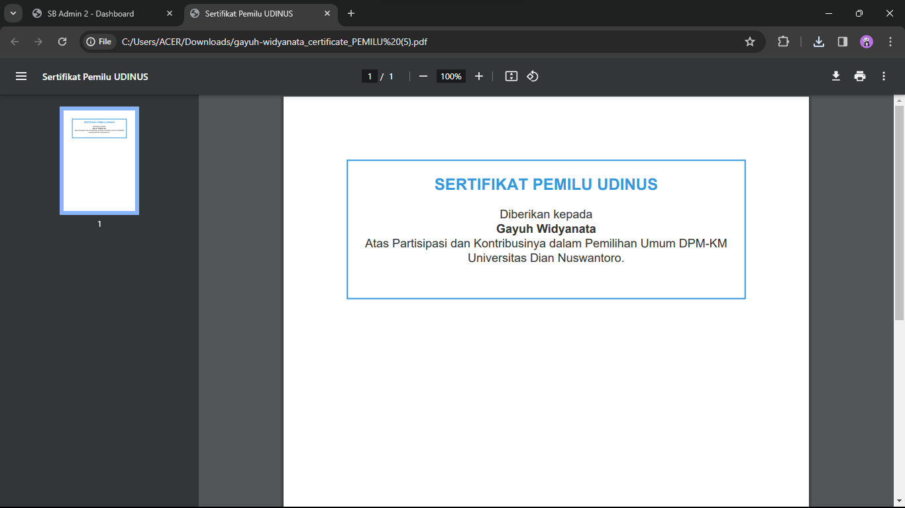

